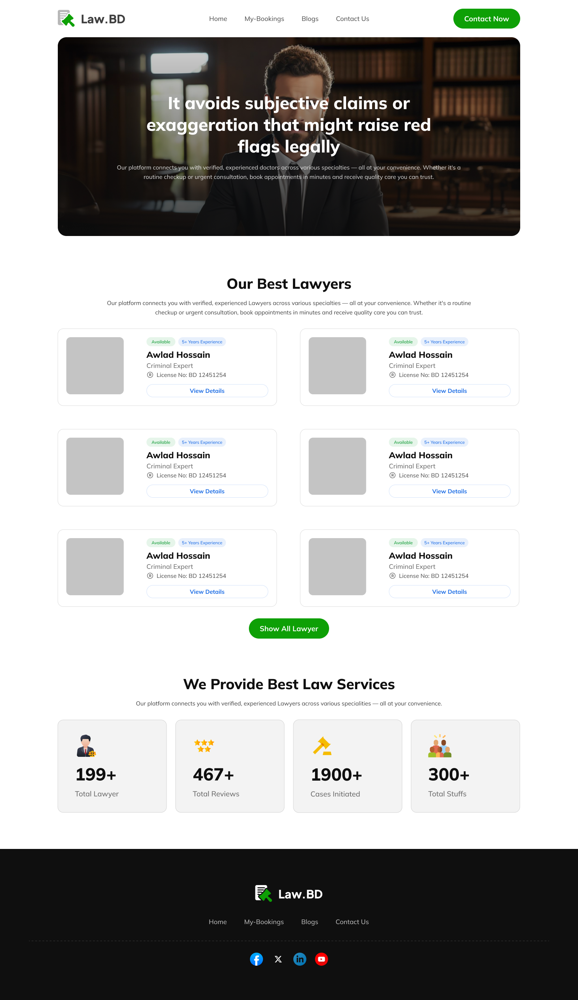
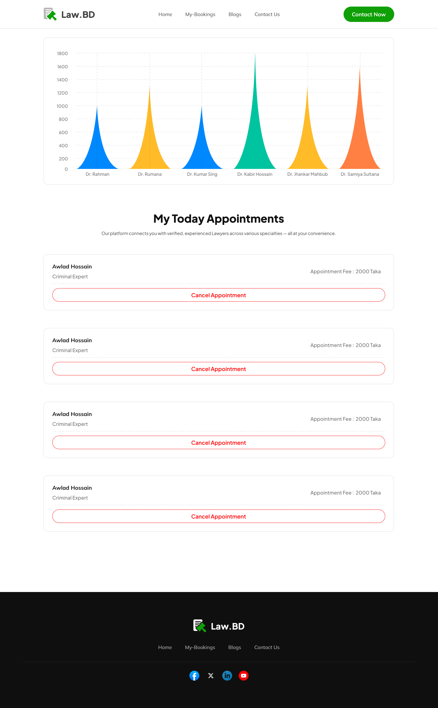
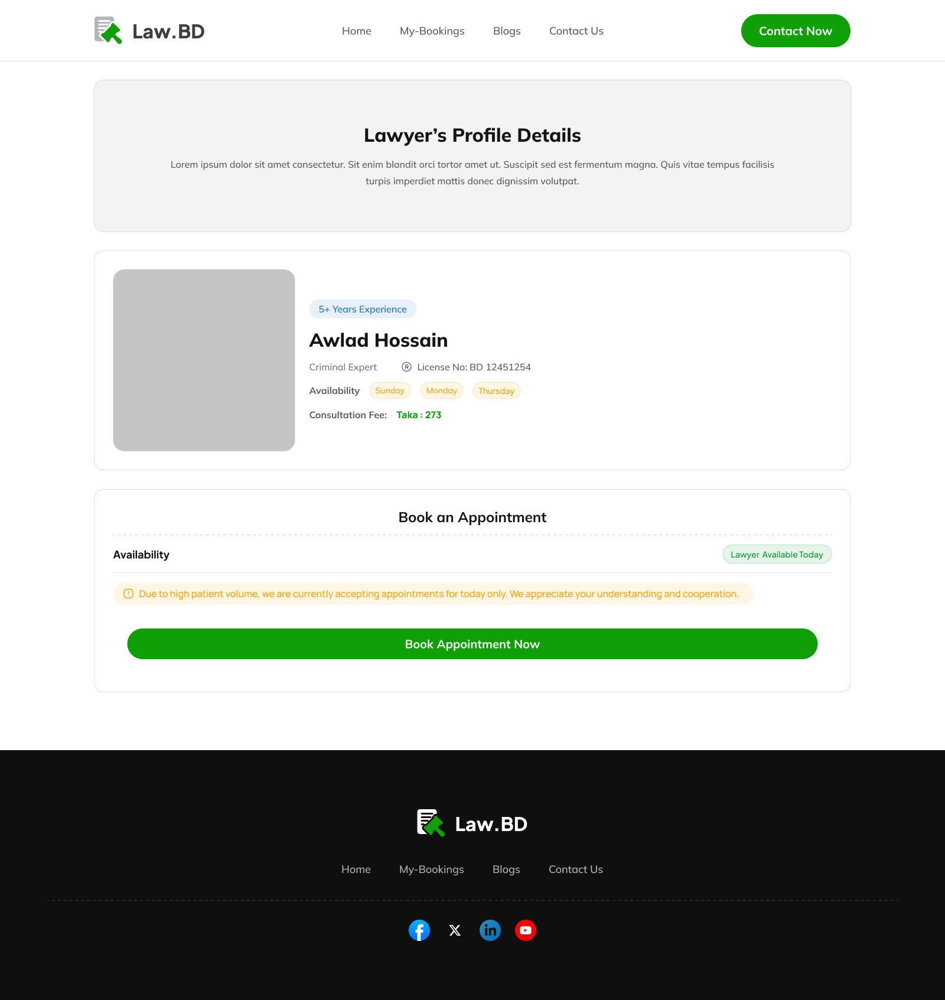

# Lawyer Appointment Booking System

# Live Demo : [Click Here](https://lawyer-appointment-booking-system.vercel.app/)

Lawyer Booking Web App 🧑‍⚖️📅
A responsive and interactive lawyer appointment booking platform built with React. The app allows users to browse lawyers, book appointments, view current bookings, and visualize booking data.

✨ Features:
-> Browse & book appointments with verified lawyers
-> Store bookings using localStorage
-> Cancel appointments with real-time UI updates
-> Success/error notifications via React Toastify
-> Animated stats using React CountUp
-> Visual insights with Recharts (e.g., booked vs available lawyers)

🔧 Tech Stack:
-> React, React Router
-> Tailwind CSS
-> React Toastify
-> React CountUp
-> Recharts
-> LocalStorage for state persistence

  
  

